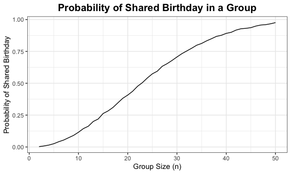

p8105_hw5_fw2394
================
Fang Wang
2024-11-14

# Load library and set up:

# Problem 1

## Draw “birthdays” to check duplicates:

``` r
bday_sim = function (n) {
  bdays = sample (1:365, size = n, replace = TRUE)
  
  duplicate = length(unique(bdays)) < n
  
  return (duplicate)
}

set.seed(0415)
bday_sim (200)
```

    ## [1] TRUE

*The “TRUE” means that there is at least one pair of people in a group
of 200 share the same birthday.*

## Run 10000 times for each group size between 2 and 50:

``` r
sim_result =
  expand_grid (
    n = 2:50,
    iter =1:10000
  ) |> 
  mutate (result = map_lgl(n, bday_sim)) |> 
  group_by(n) |> 
  summarise (prob_duplicate = mean(result))
```

*In the dataset, “n” represents the size of a group. “prob_duplicate”
represents the estimated probability of having at least one pair of
people with the same birthday for different group sizes n.*

## Make a plot between group size and probability of shared birthday:

``` r
sim_result |> 
  ggplot(aes (x = n, y = prob_duplicate)) +
  geom_line() +
  labs(
    title = "Probability of Shared Birthday in a Group",
    x = "Group Size (n)",
    y = "Probability of Shared Birthday"
  ) +
  theme(plot.title=element_text(size=15, face="bold"))+
  theme(plot.title = element_text(hjust = 0.5))
```


*The plot illustrates the birthday paradox: as group size grows, the
probability of a shared birthday rises sharply. Despite 365 possible
birthdays, a relatively small group is enough to make a shared birthday
likely.*
