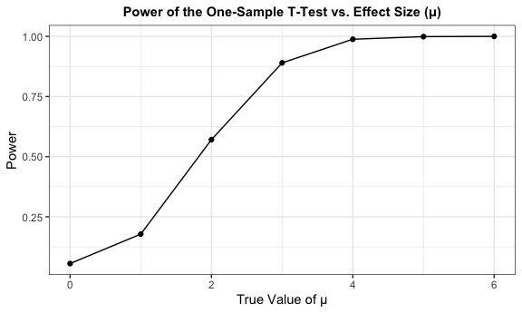
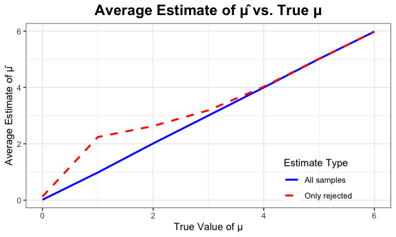
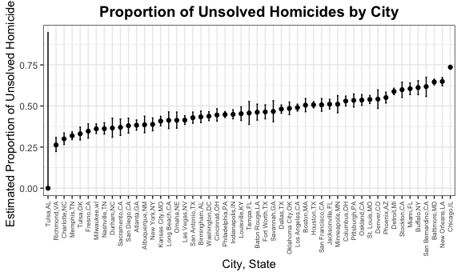

p8105_hw5_fw2394
================
Fang Wang
2024-11-14

# Load library and set up:

# Problem 1

## Draw “birthdays” to check duplicates:

``` r
bday_sim = function (n) {
  bdays = sample (1:365, size = n, replace = TRUE)
  
  duplicate = length(unique(bdays)) < n
  
  return (duplicate)
}

set.seed(0415)
bday_sim (200)
```

    ## [1] TRUE

*The “TRUE” means that there is at least one pair of people in a group
of 200 share the same birthday.*

## Run 10000 times for each group size between 2 and 50:

``` r
sim_result =
  expand_grid (
    n = 2:50,
    iter =1:10000
  ) |> 
  mutate (result = map_lgl(n, bday_sim)) |> 
  group_by(n) |> 
  summarise (prob_duplicate = mean(result))
```

*In the dataset, “n” represents the size of a group. “prob_duplicate”
represents the estimated probability of having at least one pair of
people with the same birthday for different group sizes n.*

## Make a plot between group size and probability of shared birthday:

``` r
sim_result |> 
  ggplot(aes (x = n, y = prob_duplicate)) +
  geom_line() +
  labs(
    title = "Probability of Shared Birthday in a Group",
    x = "Group Size (n)",
    y = "Probability of Shared Birthday"
  ) +
  theme(plot.title=element_text(size=15, face="bold"))+
  theme(plot.title = element_text(hjust = 0.5))
```


*The plot illustrates the birthday paradox: as group size grows, the
probability of a shared birthday rises sharply. Despite 365 possible
birthdays, a relatively small group is enough to make a shared birthday
likely.*

# Problem 2

## write a function to create datasets:

``` r
# set parameters
set.seed(2)
n = 30
sigma = 5
alpha = 0.05
mus = 0:6
num_simulations = 5000

generate_data = function(mu, sigma, n) {
  rnorm(n, mean = mu, sd = sigma)
}
```

## write a function to perform t.test:

``` r
perform_t_test = function(data) {
  test = t.test(data, mu = 0)
  tidy_test = tidy(test)
  
  tidy_test |> 
    select(estimate, p.value) |> 
    rename(mu_hat = estimate,
           p_value = p.value)
}
```

## write a function for simulation:

``` r
simulate_for_mu = function(mu, num_simulations, n, sigma) {
  
  results = map_dfr(1:num_simulations, function(i) {
     data = generate_data(mu, sigma, n)
    
    test_results = perform_t_test(data)
    
  
    test_results |> 
      mutate(mu_true = mu)
  })
  
  return(results)
}
```

## perform simulation for all datasets:

``` r
run_simulation = function(mus, num_simulations, n, sigma) {
  
  map_dfr(mus, function(mu) {
    simulate_for_mu(mu, num_simulations, n, sigma)
  })
}

results = run_simulation(mus, num_simulations, n, sigma)

head (results)
```

    ## # A tibble: 6 × 3
    ##   mu_hat p_value mu_true
    ##    <dbl>   <dbl>   <int>
    ## 1  1.14    0.295       0
    ## 2 -0.175   0.868       0
    ## 3 -1.23    0.226       0
    ## 4  0.901   0.381       0
    ## 5  0.337   0.735       0
    ## 6 -0.180   0.845       0

## Calculate power and mean estimates

``` r
summary_results = results |> 
  group_by(mu_true) |> 
  summarize(
    power = mean(p_value < alpha), 
    avg_mu_hat = mean(mu_hat),
    avg_mu_hat_rejected = mean(mu_hat[p_value < alpha])
  )
```

## plot mu_true and power

``` r
ggplot(summary_results, aes(x = mu_true, y = power)) +
  geom_line() +
  geom_point() +
  labs(x = "True Value of μ", y = "Power", 
       title = "Power of the One-Sample T-Test vs. Effect Size (μ)")+
  theme(plot.title=element_text(size=11, face="bold")) +
  theme(plot.title = element_text(hjust = 0.5))
```


*The plot illustrates that there is a positive association between
effect size and power. As the effect size increases, the test becomes
more powerful, approaching perfect power (1.0) at higher values of mu.
This means that detecting a true effect is more likely with a larger
effect size, while smaller effect sizes result in lower power and thus a
higher chance of failing to reject the null hypothesis when it is
false.*

## plot mu_hat vs. true mu between all samples and only rejrected samples:

``` r
ggplot(summary_results, aes(x = mu_true)) +
geom_line(aes(y = avg_mu_hat, color = "All samples", linetype = "All samples"), size = 1) +
geom_line(aes(y = avg_mu_hat_rejected, color = "Only rejected", linetype = "Only rejected"), size = 1) +
  labs(x = "True Value of μ", 
       y = "Average Estimate of μ̂", 
   title = "Average Estimate of μ̂ vs. True μ") +
scale_color_manual(name = "Estimate Type", values = c("All samples" = "blue", "Only rejected" = "red")) +
scale_linetype_manual(name = "Estimate Type", values = c("All samples" = "solid", "Only rejected" = "dashed"))+
theme(plot.title=element_text(size=16, face="bold")) +
theme(plot.title = element_text(hjust = 0.5)) +
theme(legend.position = c(0.8, 0.15),
      legend.background = element_blank()) 
```

    ## Warning: Using `size` aesthetic for lines was deprecated in ggplot2 3.4.0.
    ## ℹ Please use `linewidth` instead.
    ## This warning is displayed once every 8 hours.
    ## Call `lifecycle::last_lifecycle_warnings()` to see where this warning was
    ## generated.

    ## Warning: A numeric `legend.position` argument in `theme()` was deprecated in ggplot2
    ## 3.5.0.
    ## ℹ Please use the `legend.position.inside` argument of `theme()` instead.
    ## This warning is displayed once every 8 hours.
    ## Call `lifecycle::last_lifecycle_warnings()` to see where this warning was
    ## generated.


*For smaller values of μ, the average estimate of μ in only the rejected
samples does not equal the true μ but is biased upward. This is due to
selection bias, where only samples with higher estimates are likely to
reject the null hypothesis. For larger values of μ, this bias
diminishes, and the average estimate aligns more closely with the true
value.*

# Problem 3

## Load dataset

``` r
homicides = read_csv("./data/homicide-data.csv")
```

    ## Rows: 52179 Columns: 12
    ## ── Column specification ────────────────────────────────────────────────────────
    ## Delimiter: ","
    ## chr (9): uid, victim_last, victim_first, victim_race, victim_age, victim_sex...
    ## dbl (3): reported_date, lat, lon
    ## 
    ## ℹ Use `spec()` to retrieve the full column specification for this data.
    ## ℹ Specify the column types or set `show_col_types = FALSE` to quiet this message.

## Create “city_state” variable and calcuate the total homicides & unsolved_homicides within cities:

``` r
homicides = homicides |> 
  mutate (city_state = paste(city, state, sep = ",")) 

homicides_df = homicides|> 
  group_by (city_state) |> 
  summarise (total_homicides = n(),
             unsolved_homicides = sum(disposition %in%c("Closed without arrest", "Open/No arrest")))
```

## apply pro.test to Baltimore,MD:

``` r
baltimore_data =
  homicides |> 
  filter(city_state == "Baltimore,MD") |>
  summarize(total_homicides = n(),
    unsolved_homicides = sum(disposition %in% c("Closed without arrest", "Open/No arrest"))
  )
  
prop_test_result = 
  prop.test(
  x = baltimore_data$unsolved_homicides,  
  n = baltimore_data$total_homicides
) |> 
  broom::tidy()

estimated_proportion = prop_test_result$estimate
conf_low = prop_test_result$conf.low
conf_high = prop_test_result$conf.high

df_baltimore =
  data.frame (
  city_state = "Baltimore, MD",
  estimated_proportion = round(estimated_proportion,3),
  confidence_low = round(conf_low, 3), 
  confidence_high = round(conf_high, 3)
) |> 
  knitr::kable()
```

*The table reveals an estimated proportion of unsolved homicides in
Baltimore, MD (64.6%), with a confidence interval between 62.8% and
66.3%.*

## Write a function for pro.test:

``` r
prop_test = function (x) {
  
  homicides_data = homicides |> 
  filter(city_state == x) |>
  summarize(total_homicides = n(),
    unsolved_homicides = sum(disposition %in% c("Closed without arrest", "Open/No arrest"))
  ) 
  
  prop_test_result = 
  prop.test(
  x = homicides_data$unsolved_homicides,  
  n = homicides_data$total_homicides
  ) |> 
  broom::tidy()
  estimated_proportion = prop_test_result$estimate
  conf_low = prop_test_result$conf.low
  conf_high = prop_test_result$conf.high
  
  output =
    data.frame (
    estimated_proportion = round(estimated_proportion,3),
    confidence_low = round(conf_low, 3), 
    confidence_high = round(conf_high, 3))
  
  return(output)
}
```

# Apply the function above to all cities:

``` r
city_state = unique(homicides$city_state)

prop_test_results = list()

for (i in city_state) {
  
  prop_test_results[[i]] = prop_test(i)
}
```

    ## Warning in prop.test(x = homicides_data$unsolved_homicides, n =
    ## homicides_data$total_homicides): Chi-squared approximation may be incorrect

``` r
prop_test_results = do.call(rbind, prop_test_results) |> 
  rownames_to_column(var = "city_state")
```

*The dataframe has four variables that are “city_state”,
“estimated_proportion”, confidence_low” and “confidence_high”*

## Create a plot show the relation between cities and estimated proporbility of unsolved homicides:

``` r
prop_test_results |> 
  mutate (city_state = fct_reorder(city_state,estimated_proportion)) |> 
  ggplot(aes(x= city_state, y = estimated_proportion)) +
  geom_point() +
  geom_errorbar(aes(ymin = confidence_low, ymax = confidence_high), width = 0.2) +
  labs(
    title = "Proportion of Unsolved Homicides by City",
    x = "City, State",
    y = "Estimated Proportion of Unsolved Homicides"
  ) +
  theme(axis.text.x = element_text(angle = 90, vjust = 0.5, hjust = 1, size = 6)) +
  theme(plot.title=element_text(size=14, face="bold")) +
  theme(plot.title = element_text(hjust = 0.5))
```



*The plot displays the estimated proportion of unsolved homicides for
various U.S. cities, along with their 95% confidence intervals. The
proportion of unsolved homicides varies significantly by city. Some
cities, such as Chicago, IL, New Orleans, LA, and San Bernardino, CA,
have relatively high unsolved rates, approaching or exceeding 70%.On the
other end, cities like Richmond, VA, Charlotte, NC, and Tulsa, AL have
much lower proportions of unsolved homicides, with some even below 30%.*
